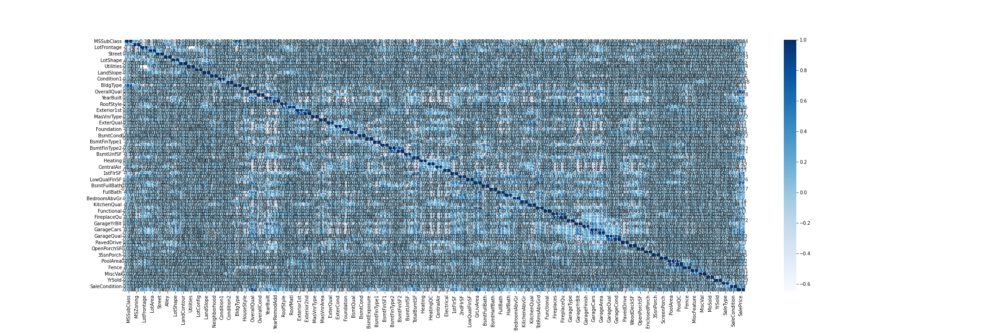

# Kaggle Practice Project

## House Prices - Advanced Regression Techniques

## Problem Description

This Kaggle Challenge is addressing factors which can influence price negotiations besides the number of bedrooms or a white-picket fence in the real estate realm.

## Procedure

1. Explarotory data analysis
2. Preparing data for modeling
3. Modeling

### 1. Explarotory data analysis

#### 1.1 Data import and observe

- description
- table

#### 1.2 categorical data encoding

- table

#### 1.3 clean

#### 1.4 correlation

### 2. Preparing training and testing data

#### 2.1 spliting

#### 2.2 normalization

### 3. Modeling

#### 3.1 building Neural Network model

#### 3.2 fiting

#### 3.3 prediction

## Result

## Reference

- [EMMANUEL DJEGOU](https://www.kaggle.com/code/emmanueldjegou/house-prices)
- [第 11 屆 iThome 鐵人賽](https://ithelp.ithome.com.tw/users/20121049/ironman/2809)
