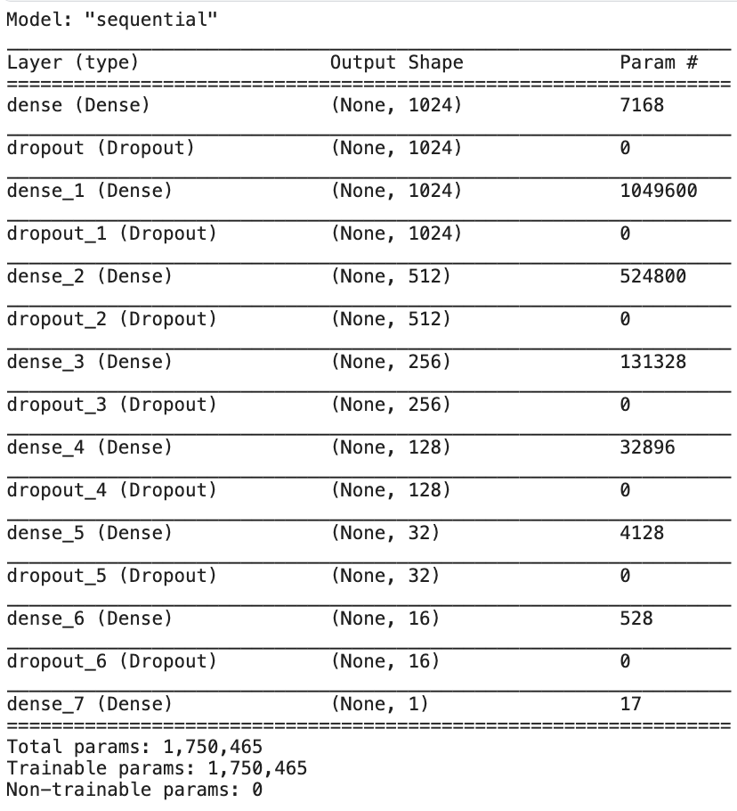

# House Prices Prediction (Kaggle Competition)

## Problem to Solve

This Kaggle Competition is to determine key factors which may influence house prices, and when factors are identified and weighted, you would use a model to predict the sales price for each house.

## Procedure

1. Explarotory Data Analysis
2. Pre-modeling preparation
3. Modeling

### 1. Explarotory Data Analysis

#### 1.1 data importing and analyzing

- description
- table

#### 1.2 categorical data encoding

- from *sklearn* import *LabelEncoder*

before:

after:

#### 1.3 data cleaning

- Drop **"ID"** column which is meaningless

#### 1.4 correlation

### 2. Pre-modeling preparation

#### 2.1 spliting

- Randomly split a group of training data
- Pull **"SalePrice"** as response variable

#### 2.2 normalization

- from *sklearn* import *LabelEncoder*

### 3. Modeling

#### 3.1 Neural Network Model building

- Use Sequential Model from *keras*
- 8 Dense and 7 Dropout layers

#### 3.2 fitting

- Choose *Adam* as Optimizer with learning rate = 0.3

#### 3.3 prediction

## Reference

- [EMMANUEL DJEGOU](https://www.kaggle.com/code/emmanueldjegou/house-prices)
- [第 11 屆 iThome 鐵人賽](https://ithelp.ithome.com.tw/users/20121049/ironman/2809)